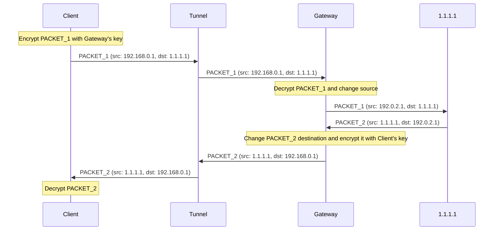

# Fān Qiáng ("翻墙") Proof of Concept

This is the Proof of Concept (PoC) of _Fān Qiáng_ ("翻墙"),
an HTTPS-based VPN tunnelling protocol that mitigates:

- **Active probing**, so censors can't detect the use of a proxy or VPN by connecting to the server, like they do in the most advanced censorship systems (e.g. [China's](https://en.wikipedia.org/wiki/Great_Firewall#Active_probing)).
- **Enumeration**, so censors can't learn all the proxies and VPN servers, like they can with [Tor](https://github.com/scriptzteam/Tor-Bridges-Collector) and virtually all VPN services (except for self-hosted VPN servers).
- **Traffic analysis**, so censors can't reliably determine the likelihood of a packet being part of a proxy or VPN connection by looking at its size, timing, or other characteristics.

In other words,
**this PoC can turn any HTTPS website into a tunnel**,
thus making user traffic pass off as regular web browsing.

## Demo

TODO.

## Scope

The objective of the PoC is to assess the feasibility of the protocol,
by focusing on the areas in which I personally lack experience (e.g. NATs, IPv6, TUN interfaces).
Consequently,
those components in which I have extensive experience,
such as authentication and encryption,
are not implemented in the PoC.
## Architecture

The main architectural difference between Fān Qiáng and other VPN protocols is that the _VPN server_ is split into two components:
The **tunnel**,
responsible for obfuscating the traffic,
and the **gateway**,
responsible for routing the traffic to and from the Internet.
We do this to circumvent censorship,
but this architecture is comparable to what VPN providers refer to as _double VPN_ —
a feature that can improve privacy and mitigate traffic correlation attacks.

The following diagram illustrates the relay of packets between a client (`192.168.0.1`) and an Internet host (`1.1.1.1`),
via a tunnel (`https://tunnel.example`) and a gateway (`192.0.2.1`, `https://gateway.example`):



The communication between the client and the tunnel, and between the tunnel and the gateway, is done over TLS.

## How this is different from other HTTPS-based tunnels

The idea of tunnelling VPN or proxy traffic through HTTPS to prevent active probing is not new.
Typically,
this is done over WebSockets;
[this is what Tor's WebTunnel _bridge_](https://blog.torproject.org/introducing-webtunnel-evading-censorship-by-hiding-in-plain-sight/)
and
[potentially many other projects on GitHub](https://github.com/search?q=%28VPN+OR+tunnel%29+AND+WebSockets&type=repositories&s=&o=desc) do.
In recent years,
the technique has been studied academically under the name
[HTTPT](https://www.usenix.org/conference/foci20/presentation/frolov).

**What sets Fān Qiáng apart is its resilience to enumeration**,
by offering a trivial and universal way to turn any HTTPS website into a tunnel.
Here,
tunnels are simply reverse proxies,
so this low barrier should allow us to offer a ratio of tunnels to users that's orders of magnitude higher than existing solutions.

For example,
an existing Nginx `server {...}` block for `example.com` could host a Fān Qiáng tunnel under `https://example.com/<random-path>` with the following configuration:

```nginx
location /<random-path> {
    # To minimise latency, use a gateway close to the tunnel.
    proxy_pass https://london.gb.gateways.relaycorp.tech/tunnel;
    
    # Enable WebSockets
    proxy_http_version 1.1;
    proxy_set_header Upgrade $http_upgrade;
    proxy_set_header Connection "upgrade";
    
    access_log off;
}
```

**This is all that's needed to set up a tunnel**.
By contrast,
existing solutions also require the tunnel operator to set up and operate a purpose-built WebSocket server;
worse yet,
some even require elevated privileges to use sensitive networking capabilities.

## Protocol

In this PoC,
the connection starts with the gateway sending a WebSockets text frame with the IPv4 and IPv6 subnets allocated to the client (e.g. `10.0.102.0/30,fd00:1234::2:0/128`).
From then on,
the client and the gateway exchange IP packets over the WebSockets connection.

Although not implemented in this PoC,
the client and gateway will exchange E2E encrypted _noise_ messages of random sizes and at random intervals to mitigate traffic analysis.

### Why create a new VPN protocol

In principle,
we're only interested in the tunnelling aspect.
The underlying VPN protocol,
whether it's OpenVPN® or WireGuard®,
should be irrelevant.
In practice,
however,
the **current** implementations of OpenVPN® and WireGuard® would prove exceptionally problematic in production.

Neither OpenVPN® nor WireGuard® servers natively support a client-side interfaces based on WebSockets,
so we would've to implement and/or integrate **another middleware** (e.g. [wstunnel](https://github.com/erebe/wstunnel)) to bridge the two.
This would've added significant complexity and costs in production,
and reduced performance.

If we were to do any kind of advanced integration with the VPN protocol,
we would've only considered WireGuard®,
given its simplicity,
but much to our regret,
it wasn't a viable option.
We would've faced the same [challenges that led Cloudflare to create their own implementation from scratch](https://blog.cloudflare.com/boringtun-userspace-wireguard-rust/).
Unfortunately,
[Cloudflare appears to have abandoned their implementation](https://github.com/cloudflare/boringtun/issues/407),
and whilst [a fork has emerged recently](https://github.com/cloudflare/boringtun/issues/407#issuecomment-2198051893),
it's too soon to tell if it will be reliable enough for production.

In other words,
we would've used the WireGuard® protocol had it not been for its current implementations,
which would make it too risky and costly to deploy to production in our case.
If this project takes off,
we'll probably contribute to WireGuard®,
so we can replace our VPN protocol and focus on the tunnelling.

## Alternative tunnelling methods

Future versions of the protocol may support additional tunnelling methods.
By baking tunnelling into the protocol,
the gateway can automatically support any type of tunnelling method that the client uses,
whilst preserving the E2E encryption between the client and the gateway.
Alternative methods could include:

- Video calls, preferably using an E2E encrypted platform like Zoom.
  The client would use a _virtual webcam_ (see [pyvirtualcam](https://pypi.org/project/pyvirtualcam/)) to send packets, and a video decoder for the incoming packets.
  The tunnel would decode the video stream from the client and send the packets to the gateway,
  and encode the packets from the gateway and send them to the client.
- Email (SMTP and IMAP).
  Once configured with the credentials,
  the client and the tunnel would exchange packets via email with no user intervention.
  Packets would be batched for efficiency.

Naturally,
the methods above would be used sparingly to avoid detection and because of their extremely low throughput.
It should also be considered whether the method would breach the terms of the underlying service.
