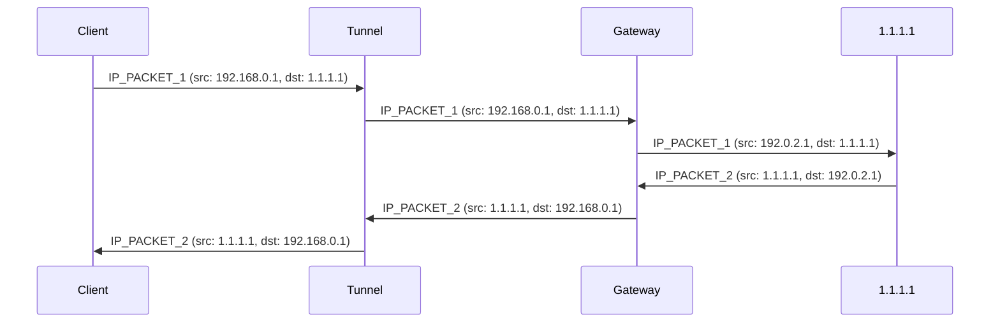

# Fān Qiáng ("翻墙") Proof of Concept

This is the Proof of Concept (PoC) of _Fān Qiáng_ ("翻墙"),
a VPN protocol that's resilient to [active probing](https://en.wikipedia.org/wiki/Great_Firewall#Active_probing) and
[enumeration](https://github.com/scriptzteam/Tor-Bridges-Collector).
This PoC turns **any HTTPS website** into a tunnel,
thus making user traffic pass off as regular web browsing.
Future versions of the protocol may support additional tunnelling methods,
such as videoconferencing software like Zoom.

## Demo

TODO.

## Scope

The objective of the PoC is to assess the feasibility of the protocol,
by focusing on the areas in which I personally lack experience (e.g. NATs, TUN devices).
Consequently,
those components in which I have extensive experience,
such as authentication and encryption,
are not implemented in the PoC.

## Architecture

The main architectural difference between Fān Qiáng and other VPN protocols is that the _VPN server_ is split into two components:
The **tunnel**,
responsible for obfuscating the traffic,
and the **gateway**,
responsible for routing the traffic to and from the Internet.
The following diagram illustrates the relay of packets between a client (`192.168.0.1`) and an Internet host (`1.1.1.1`),
via a tunnel (`https://tunnel.example`) and a gateway (`192.0.2.1`, `https://gateway.example`):



Although we're splitting the VPN server to circumvent censorship,
this architecture is comparable to what VPN providers refer to as _double VPN_ --
a feature that can improve privacy and mitigate traffic correlation attacks.

## How this is different from other HTTPS-based tunnels

The idea of tunnelling VPN or proxy traffic through HTTPS websites to prevent active probing is not new.
Typically,
this is done over WebSockets;
[the Tor project uses it as one of its _bridges_](https://blog.torproject.org/introducing-webtunnel-evading-censorship-by-hiding-in-plain-sight/) and,
as of mid 2024,
[138 GitHub repositories match the query `(VPN OR tunnel) AND WebSockets`](https://github.com/search?q=%28VPN+OR+tunnel%29+AND+WebSockets&type=repositories&s=&o=desc).
In recent years,
the technique has been studied academically under the name
[HTTPT](https://www.usenix.org/conference/foci20/presentation/frolov).

**What sets Fān Qiáng apart is its resilience to enumeration**,
by offering a trivial and universal way to turn any HTTPS website into a tunnel.
Here,
tunnels are simply reverse proxies,
so this low barrier should allow us to offer a far greater ratio of tunnels to users,
which will in turn make it harder for censors to enumerate them,
whilst making it easy to camouflage VPN traffic as regular web browsing --
potentially across multiple websites.

For example,
an existing Nginx `server {...}` block for `example.com` could host a Fān Qiáng tunnel under `https://example.com/<random-path>` with the following configuration:

```nginx
location /<random-path> {
    # For performance reasons, use a gateway close to the tunnel.
    proxy_pass https://london.gb.gateways.relaycorp.tech/tunnel;
    
    # Enable WebSockets
    proxy_http_version 1.1;
    proxy_set_header Upgrade $http_upgrade;
    proxy_set_header Connection "upgrade";
    
    access_log off;
}
```

This is all that's needed to set up a tunnel.
By contrast,
existing solutions also require the tunnel operator to set up and operate a purpose-built WebSocket server.

## Why create a new VPN protocol

In principle,
we're only interested in tunnelling traffic between VPN clients and servers.
The underlying VPN protocol,
whether it's OpenVPN® or WireGuard®,
should be irrelevant.
In practice,
however,
the **current** implementations of OpenVPN® and WireGuard® will have proven exceptionally problematic in production.

Neither OpenVPN® nor WireGuard® servers natively support a client-side interfaces based on WebSockets,
so we would've to implement and/or integrate a middleware like [wstunnel](https://github.com/erebe/wstunnel) to bridge the two.
This would've added significant complexity and costs in production.

If we were to do any kind of advanced integration with the VPN protocol,
we would've only considered WireGuard®,
given its simplicity,
but much to our regret,
it wasn't a viable option.
We would've faced the same [challenges that led Cloudflare to create their own implementation from scratch](https://blog.cloudflare.com/boringtun-userspace-wireguard-rust/),
which [appears to be abandoned now](https://github.com/cloudflare/boringtun/issues/407).
[A fork has emerged recently](https://github.com/cloudflare/boringtun/issues/407#issuecomment-2198051893),
but it's too soon to tell if it will be reliable enough for production.

In other words,
we would've used the WireGuard® protocol had it not been for its current implementations,
which would make it too risky and costly to deploy to production in our case.
If we go through with this project,
and it becomes successful,
we'll probably replace our VPN protocol with WireGuard®.
